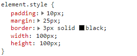
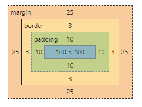
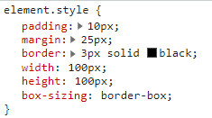

# knowledgeCheck


## HTML/CSS
### A short brief on what you need to know about the "Box Model".

1. All pages consist of HTML elements. The elements have are rectangles or boxes around them. The principles of behavior of these boxes, collected in the Box Model. Understanding it allows us to build more complex interfaces.

2. Initially, all elements were divided into inline and block. Now, this does not meet the specification, but the concept remains so that it would be easier to explain the principles.

3. Block and inline elements differ in behavior. The peculiarities of block elements are that by default they take up the entire width of the parent block, start with the new line, they can contain other block elements, and the height automatically adjusts to the content. Blocks are intended for building the structure of the page.

4. The model defines the behavior of the block elements to be displayed on the page. It affects the different parts of the element that it includes: margin, border, padding, and content.

How it looks can be very easily seen in the developer tool:


5. What can do with the block? first, we can give it a width and height. Next, set padding so that the edges of the content do not touch the border. Then we can set a border to the container. In the end, we can set the margin to push our block away from other blocks.
There is a peculiarity in the behavior of external margins that can collapse vertically. This needs to be monitored.




6. If we took the layout's width, applied it to my element, and set up all the padding, border, and margin, we will find that it does not match the layout. The answer lies in the peculiarities of changes in the block model. the default widths set are relative to the content. and all our borders and padding are added to the width. This is very inconvenient when coding from a layout in a Pixel Perfect since you have to calculate the values ​​of the width of the content - padding and border. For this, the box-sizes property was invented. The default is content-box, but most often I change to border-box and apply to bod. This property changes the box model and it treats the given width as including the border, padding, and border. Thus, we can not think about what size the content has and can easily control the visible dimensions from the layout. Outside margins remain outside the box width. which allows you to more independently configure its behavior relative to other blocks without changing the size of the block itself.




7. This is a quick overview of the block model. For a more detailed and deeper understanding. I would recommend these links:
 https://developer.mozilla.org/en-US/docs/Learn/CSS/Building_blocks/The_box_model  
 https://developer.mozilla.org/en-US/docs/Web/HTML/Block-level_elements  
 https://developer.mozilla.org/en-US/docs/Web/Guide/HTML/Content_categories  


## JS exercise 
We have array for exapmle:  
```javascript
const sales = [
  { itemSold: “Football”, price: 19.99, dateSold: ‘2018-04-07’, id: ‘j_123’ }, 
  { itemSold: “Trainers”, price: 159.95, dateSold: ‘2018-03-02’, id: ‘t_acds1’ }, 
  { itemSold: “Cricket bat”, price: 204.97, dateSold: ‘2018-04-05’, id: ‘j_456’}, 
  { itemSold: “Rugby ball”, price: 30.00, dateSold: ‘2017-04-22’, id: ‘t_acds3’ }, 
  { itemSold: “Hockey stick”, price: 54.95, dateSold: ‘2017-03-19’, id: ‘j_999’ } 
] 
```

How we can:
### 1. Return the sum of the price of all properties as a single value.

Answer: 
```javascript
sales.reduce((acc, it) => acc += it.price, 0).toFixed(2)
```
Return: 
```javascript
469.86
```

### 2. Return the items which were sold in 2017.

Answer: 
```javascript
sales.filter((it) => it.dateSold.split('-')[0] === '2017')
```
Return: 
```javascript
[{
  dateSold: "2017-04-22",
  id: "t_acds3",
  itemSold: "Rugby ball",
  price: 30
}, {
  dateSold: "2017-03-19",
  id: "j_999",
  itemSold: "Hockey stick",
  price: 54.95
}]
```

### 3. Return an array of all of the itemsSold properties as strings, sorted alphabetically.

Answer: 
```javascript
sales.sort((a, b) => {
	if (a.itemSold < b.itemSold) {
    return -1;
  }
  if (a.itemSold > b.itemSold) {
    return 1;
  }});
```
Return: 
```javascript
[{
  dateSold: "2018-04-05",
  id: "j_456",
  itemSold: "Cricket bat",
  price: 204.97
}, {
  dateSold: "2018-04-07",
  id: "j_123",
  itemSold: "Football",
  price: 19.99
}, {
  dateSold: "2017-03-19",
  id: "j_999",
  itemSold: "Hockey stick",
  price: 54.95
}, {
  dateSold: "2017-04-22",
  id: "t_acds3",
  itemSold: "Rugby ball",
  price: 30
}, {
  dateSold: "2018-03-02",
  id: "t_acds1",
  itemSold: "Trainers",
  price: 159.95
}]
```
*NOTE: sort method don't return new array, but change old one.*

### 4. Using id as an argument, return the sale which matches the id.

Answer: 
```javascript
const findId = (id) => sales.find((el) => el.id === id);
findId('t_acds3');
```
Return: 
```javascript
{
  dateSold: "2017-04-22",
  id: "t_acds3",
  itemSold: "Rugby ball",
  price: 30
}
```

## Replicate layout

### `yarn install`

Install all dependencies


### `yarn start`

Runs the app in the development mode.

### `yarn build`

Builds the app for production to the `build` folder.\
It correctly bundles React in production mode and optimizes the build for the best performance.

The build is minified and the filenames include the hashes.\
Your app is ready to be deployed!

Description:

The project was made using create-react-app + sass to speed up the initial setup.
React offers a component-based approach to building the interface, which satisfies the requirements the current project.

The project is represented by a tree of nested components:  
* App:
  - Header:  
    - H1: main header  
    - Search: the search component.  
  - MainLayout: Layout containing the "main" tag and styling the site's main grid  
    - Content
    - Sidebar

Each of the components has modular SCSS files to guarantee the independence of the CSS properties.

A naming of CSS properties was based on BEM methodology.

When marking up large logical blocks, flow elements such as section, aside, main were applied. The use of these elements improves the semantics of the page.

Viewpoints were applied to adapt the grid for different devices. In our case, the positioning of the content and sidebar changes from sequential display to display in 2 columns.

Small components such as Search are independent of their parents and can be reused elsewhere.
For the input field, a hidden label has been added for screen readers' users.

The search button has styles for hover and active state to improve the user experience. In this case, the effect of scaling up and down was chosen as an example. These effects can be adjusted and varied at the design stage for compliance with the general design of the application.
