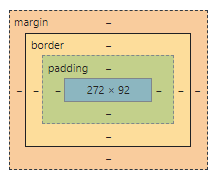

# knowledgeCheck

## HTML/CSS
### A short brief on what you need to know about the block model.

1. All pages consist of HTML elements. The elements have are rectangles or boxes around them. The principles of behavior of these boxes, collected in the Box Model. Understanding it allows us to build more complex interfaces.

2. Initially, all elements were divided into inline and block. Now, this does not meet the specification, but the concept remains so that it would be easier to explain the principles.

3. Block and inline elements differ in behavior. The peculiarities of block elements are that by default they take up the entire width of the parent block, start with the new line, they can contain other block elements, and the height automatically adjusts to the content. Blocks are intended for building the structure of the page.

4. The model defines the behavior of the block elements to be displayed on the page. It affects the different parts of the element that it includes: margin, border, padding, and content.

How it looks can be very easily seen in the developer tool:

5. What can do with the block? first, we can give it a width and height. Next, set padding so that the edges of the content do not touch the border. Then we can set a border to the container. In the end, we can set the margin to push our block away from other blocks.
There is a peculiarity in the behavior of external margins that can collapse vertically. This needs to be monitored.

6. If we took the layout's width, applied it to my element, and set up all the padding, border, and margin, we will find that it does not match the layout. The answer lies in the peculiarities of changes in the block model. the default widths set are relative to the content. and all our borders and padding are added to the width. This is very inconvenient when coding from a layout in a Pixel Perfect since you have to calculate the values ​​of the width of the content - padding and border. For this, the box-sizes property was invented. The default is content-box, but most often I change to border-box and apply to bod. This property changes the box model and it treats the given width as including the border, padding, and border. Thus, we can not think about what size the content has and can easily control the visible dimensions from the layout. Outside margins remain outside the box width. which allows you to more independently configure its behavior relative to other blocks without changing the size of the block itself.

7. This is a quick overview of the block model. For a more detailed and deeper understanding. I would recommend these links:
https://developer.mozilla.org/en-US/docs/Learn/CSS/Building_blocks/The_box_model
https://developer.mozilla.org/en-US/docs/Web/HTML/Block-level_elements
https://developer.mozilla.org/en-US/docs/Web/Guide/HTML/Content_categories
